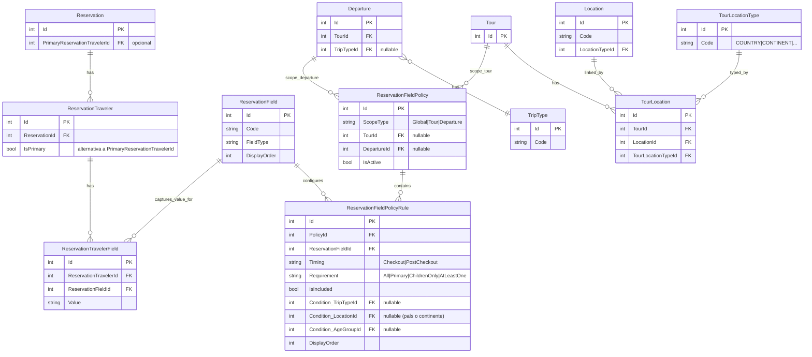

## Documento técnico: Campos requeridos de viajeros (Checkout + Middleweb)

### Contexto

Actualmente:

- `ReservationField` contiene el **catálogo** de campos disponibles (ej. `name`, `surname`, `email`, `phone`, `sex`, `birthdate`, `national_id`, `passport`, `passportexpiration`).
- `ReservationTravelerField` contiene los **valores introducidos** por cada viajero para esos campos.
- `DepartureReservationField` contiene los **campos requeridos por salida** pero hoy se rellena desde la integración de Tourknife (TK), lo cual implica que TK tiene la responsabilidad de “decidir” qué se pide.

Objetivo:

- La responsabilidad de **definir qué campos se piden y cuándo** pasa a **nuestra BD + Middleweb** (configuración).
- TK/sync deja de ser fuente de verdad de “required fields”.
- Checkout consulta a nuestra API qué campos son obligatorios **para reservar** y cuáles son “para completar después”.

---

### Reglas funcionales (contrato)

#### 1) Mínimos para crear reserva (siempre en checkout)

- Para **todos los viajeros**: `name`, `surname`.
- Para **al menos 1 viajero**: `email` y `phone`.
  - Ese viajero se considera el **viajero principal**.

#### 2) Condicional por tipo de salida

- Si salida `single` o `mixto`: `sex` obligatorio para **todos los viajeros**.
- Si hay **niños**: `birthdate` obligatorio para **los viajeros niños**.

> Implementación: el “tipo de salida” se determina por `Departure.TripTypeId` (catálogo `TripType`, seed `triptypes.json`).

#### 3) Condicional por destino (Europa vs fuera de Europa)

- Si destino del tour está en continente **Europa**: `national_id` (DNI) requerido para el **viajero principal**.
- Si destino del tour está en continentes **no Europa**: `passport` y `passportexpiration` por viajero.

> Nota: los campos de “seguros” (DNI del viajero principal) y los de documentación (pasaporte/caducidad) pueden ser:
> - **obligatorios en checkout** si la configuración lo indica, o
> - **requeridos para completar después** (workflows/avisos), pero no bloquean crear la reserva.

#### 4) Configuración adicional por Tour/Salida

Middleweb debe poder marcar campos adicionales como:

- requeridos **en checkout** (bloquean crear reserva), o
- requeridos **post-checkout** (se completan después).

Además, deben poder aplicarse por:

- ámbito global (por defecto),
- `Tour`,
- `Departure/Salida`.

---

### Principios de diseño

- **Separar**:
  - “Catálogo de campos” (qué existe) de
  - “Política de requerimientos” (qué se pide y cuándo) de
  - “Valores” (qué se rellenó).
- Resolver reglas por **proximidad (ámbito)**: `Departure` > `Tour` > `Global` (el más cercano manda).
- Devolver al front un contrato explícito: listas de campos para `Checkout` y para `PostCheckout`, indicando **a quién aplica** (todos / principal / niños / al menos uno).

---

### Dónde tenemos que actuar (impacto por sistemas)

#### Middleweb (configuración)

Objetivo: poder gestionar políticas en 3 niveles, siempre mostrando herencia y permitiendo override por proximidad.

```mermaid
flowchart TD
  A[Configuración Global<br/>Campos requeridos viajeros] -->|ver/editar| GA[Rules Global]
  B[Ficha Tour<br/>Campos requeridos viajeros] -->|ver| GB[Global (solo lectura)]
  B -->|editar| TB[Tour override (editable)]
  C[Edición Departure/Periodo<br/>Campos requeridos viajeros] -->|ver| GC[Global (solo lectura)]
  C -->|ver| TC[Tour (solo lectura)]
  C -->|editar| DC[Departure override (editable)]

  GA --> P[Preview resultado efectivo]
  TB --> P
  DC --> P
```

##### Interfaz Middleweb (pantallas y comportamiento)

> Esta sección describe la UI/UX esperada. No define componentes concretos, pero sí los flujos y los campos necesarios para operar con `ReservationFieldPolicy` y `ReservationFieldPolicyRule`.

###### Navegación

- Menú: `Configuración` → `Campos requeridos de viajeros (Global)`
- Ficha de tour: pestaña/sección `Campos requeridos de viajeros`
- Edición de salida/periodo/departure: pestaña/sección `Campos requeridos de viajeros`

###### Reglas comunes de la UI

- La UI debe mostrar siempre:
  - **Configuración efectiva** (lo que realmente aplica)
  - y el **origen** por campo: `Global` / `Tour` / `Departure`
- Para “quitar” un campo heredado, se crea una regla en el ámbito actual con:
  - `IsIncluded=false` (override por exclusión)
- Precedencia fija: **Departure > Tour > Global**

###### Ayuda, autodocumentación y coherencia (obligatorio en el diseño)

Las tres pantallas (Global, Tour, Departure) deben permitir que **operación y negocio** configuren políticas **sin depender de explicaciones del equipo técnico**. Criterios mínimos:

- **Texto introductorio** en cada pantalla (1–2 párrafos): qué ámbito se edita (solo global / solo este tour / solo esta salida), qué pasa con lo no definido (herencia), y recordatorio de precedencia **Departure > Tour > Global** cuando aplique.
- **Tooltips** en columnas y condiciones: `IsIncluded`, `Timing`, `Requirement`, `TripType`, `Location` (continente vs país), `AgeGroup`. Mismos textos y criterios en las tres pantallas para no generar dudas.
- **Bloque “Cómo funciona”** (colapsable o ancla fácil de encontrar): Checkout vs PostCheckout; uso de `LocationId` para destino; mínimos de reserva (nombre/apellidos en todos; email/teléfono al menos en un viajero); enlace o referencia al documento técnico adjunto a la User Story #1414.
- **Pantalla Tour**: texto fijo del tipo “Estás editando solo este tour; lo no definido aquí sigue heredado de Global” y **ejemplos cortos** (quitar un campo heredado con `IsIncluded=false`; subir un campo a Checkout solo en este tour).
- **Pantalla Departure**: **banner visible** con el orden de aplicación y que los cambios afectan **solo a esta salida**; ejemplos de cuándo usar override puntual (ej. forzar documentación en checkout en una fecha concreta).

###### Pantalla A: Configuración global (editable)

**Objetivo**: editar la base del sistema.

Layout recomendado:

- Cabecera:
  - Título: “Campos requeridos de viajeros (Global)”
  - Selector “Policy global activa” (si se permite más de una; si no, se omite)
  - Botón “Guardar”
- Editor de reglas (tabla):
  - Columnas:
    - **Campo** (`ReservationField`: Name + Code)
    - **Incluido** (`IsIncluded` toggle)
    - **Momento** (`Timing`: Checkout / PostCheckout)
    - **Aplicación** (`Requirement`)
    - **Trip type** (`Condition_TripTypeId`, opcional; multi-select)
    - **Destino** (`Condition_LocationId`, opcional; selector de `Location`)
      - El selector debe permitir filtrar por **Continentes** y **Países** (ambos son `Location`)
    - **Grupo edad** (`Condition_AgeGroupId`, opcional)
    - **Orden** (`DisplayOrder`, opcional)
  - Acciones:
    - “Añadir regla”
    - “Duplicar regla”
    - “Eliminar regla”
- Panel “Preview” (resultado efectivo):
  - Inputs de contexto para simular:
    - `TripTypeId`
    - `continentLocationId`
    - `primaryCountryLocationId` (opcional)
    - `AgeGroupId/Hay niños`
  - Outputs:
    - Lista **Arriba (Checkout)** = reglas efectivas con `Timing=Checkout`
    - Lista **Ver más (PostCheckout)** = reglas efectivas con `Timing=PostCheckout`

###### Pantalla B: Tour (global solo lectura + override tour)

**Objetivo**: permitir overrides por tour, viendo lo heredado.

Layout recomendado (3 bloques):

- **Global (solo lectura)**:
  - tabla de reglas globales
- **Tour (editable)**:
  - tabla de reglas `ScopeType=Tour` para ese `TourId`
  - acciones: “Añadir override”, “Guardar”
  - al editar una regla:
    - mostrar “Efectivo actual” (desde Global) y “Override Tour” (lo que se guardará)
- **Resultado efectivo (preview real)**:
  - muestra el conjunto Global + Tour, con origen por campo

###### Pantalla C: Departure/Periodo/Salida (global + tour solo lectura + override departure)

**Objetivo**: permitir overrides por salida, viendo global y tour.

Layout recomendado (4 bloques):

- **Global (solo lectura)**
- **Tour (solo lectura)**
- **Departure (editable)**:
  - tabla `ScopeType=Departure` para ese `DepartureId`
  - acciones: “Añadir override”, “Guardar”
- **Resultado efectivo**:
  - usa el contexto real cuando sea posible:
    - `Departure.TripTypeId` (ya existe)
    - continente/país del tour vía `TourLocation` (si la middle lo tiene disponible en ese formulario)

###### Validaciones y restricciones recomendadas en Middleweb

- Evitar duplicados en el mismo ámbito:
  - misma combinación `ReservationFieldId` + condiciones (TripType/Location/AgeGroup) debería ser única.
- `IsIncluded=false`:
  - se puede permitir mantener `Timing/Requirement` rellenos, pero la UI debe dejar claro que **no aplica**.
- Accesibilidad/claridad:
  - Siempre mostrar la precedencia fija en un texto: “Departure > Tour > Global”.

1) **Pantalla de configuración global**

- Nuevo apartado en Middleweb: **“Campos requeridos de viajeros (Global)”**
- Permite **ver y editar**:
  - Policies `ScopeType=Global` activas
  - Rules asociadas (`ReservationFieldPolicyRule`)
- Debe permitir:
  - activar/desactivar (`IsIncluded`) por campo y condición
  - seleccionar `Timing` (Checkout/PostCheckout)
  - seleccionar `Requirement`
  - condiciones: `Condition_TripTypeId`, `Condition_LocationId` (continente/país), `Condition_AgeGroupId`

2) **Ficha de Tour**

- Sección “Campos requeridos de viajeros”:
  - **Ver configuración global** (solo lectura)
  - **Configurar a nivel Tour** (crear/editar policy `ScopeType=Tour` para ese `TourId`)
- El formulario debe hacer explícito que:
  - la configuración de Tour **pisa** la global para el mismo campo/condición (y `IsIncluded=false` sirve para “quitar” lo global).

3) **Edición de Periodo / Departure / Salida**

- Sección “Campos requeridos de viajeros”:
  - **Ver configuración global** (solo lectura)
  - **Ver configuración del Tour** (solo lectura)
  - **Configurar a nivel Departure** (crear/editar policy `ScopeType=Departure` para ese `DepartureId`)
- Debe reflejar claramente la precedencia: Departure > Tour > Global.

> UX recomendada en Middleweb: vista tipo “diff” por campo (resultado efectivo) y debajo el origen (Global/Tour/Departure) que lo está aportando.

#### Web (Checkout v3, paso 3)

Objetivo: en el paso 3 del checkout, la UI debe consultar qué pedir y validar antes de continuar.

1) **Carga de requerimientos**

- Al entrar en el paso 3 (Traveler data form), llamar a:
  - `GET api/reservations/requirements?tourId=...&departureId=...`
- Respuesta: listas `checkout` y `postCheckout` con `fieldCode/reservationFieldId/requirement` (y opcionalmente `displayOrder`).

2) **Renderizado**

- **Parte superior (siempre visible)**:
  - siempre primero: `name`, `surname`, `email`, `phone`
  - después, cualquier otro campo con `Timing=Checkout` (requerido) aplicable
- **Botón “Ver más”**:
  - mostrar solo campos `Timing=PostCheckout` (no bloquean reservar) y/o opcionales si se decide.

3) **Validación al continuar**

- Al pulsar continuar, llamar a:
  - `POST api/reservations/{reservationId}/travelers/validate`
- El backend valida contra la configuración efectiva:
  - reglas por viajero (all/primary/children)
  - reglas globales tipo “AtLeastOneTravelerMustProvide(email/phone)”
- Si hay errores: devolver estructura por viajero/campo para pintar validaciones en el formulario.

#### Web (Bookings v2 / vista de reserva)

Objetivo: adaptar la vista de datos personales para:

- mostrar correctamente los campos guardados (`ReservationTravelerField`) por viajero
- y, si aplica, indicar “pendientes” (los `Timing=PostCheckout` requeridos que aún no estén completos)

Regla de UI:

- En el panel del viajero:
  - Mostrar siempre `name/surname` (y `email/phone` si están presentes)
  - Para campos requeridos post-checkout no completados, mostrar estado “pendiente” (y CTA si existe flujo de edición desde perfil).

#### API / Backend

Objetivo: centralizar la lógica de resolución + validación.

- Implementar `GET api/reservations/requirements`:
  - resuelve policies (Global + Tour + Departure), aplica condiciones, y produce `checkout`/`postCheckout`.
- Implementar `POST api/reservations/{reservationId}/travelers/validate`:
  - valida los datos presentes en `ReservationTravelerField` (o payload) contra la política efectiva.

#### Sync Tourknife

Objetivo: eliminar responsabilidad de “required fields” en TK y limitar payload al mínimo.

- Ajustar la sincronización/llamadas a TK para que **solo se envíen `Nombre` y `Apellidos`** por viajero (cuando TK lo requiera).
- Evitar que TK/sync rellene o sea fuente de verdad de configuraciones de requerimientos (no poblar `DepartureReservationField` como required fields).

---

### Modelo de datos propuesto

> Nota: los nombres son orientativos; lo importante es el modelo.

#### 1) Mantener entidades actuales

- `ReservationField` (catálogo).
- `ReservationTravelerField` (valores por viajero y campo).

#### 2) Persistencia del “viajero principal” (recomendado)

Para tener trazabilidad y reglas de “principal” consistentes:

- Añadir en la reserva:
  - `Reservation.PrimaryReservationTravelerId` (nullable hasta que se seleccione en checkout),
  - o alternativamente `ReservationTraveler.IsPrimary` con restricción única por `ReservationId`.

#### 3) Nuevas tablas: políticas de campos requeridos

##### `ReservationFieldPolicy`

Representa un “conjunto” de reglas activas para un ámbito.

- `Id`
- `ScopeType` (enum): `Global` | `Tour` | `Departure`
- `TourId` (nullable)
- `DepartureId` (nullable)
- `IsActive` (bool)
- (Opcional) `Name`, `CreatedAt`, `UpdatedAt`

Restricciones recomendadas:

- `ScopeType=Global` ⇒ `TourId` y `DepartureId` deben ser null.
- `ScopeType=Tour` ⇒ `TourId` obligatorio, `DepartureId` null.
- `ScopeType=Departure` ⇒ `DepartureId` obligatorio.

##### `ReservationFieldPolicyRule`

Regla individual de requerimiento de un campo.

- `Id`
- `PolicyId`
- `ReservationFieldId`
- `Timing` (enum):
  - `Checkout` (bloquea crear reserva)
  - `PostCheckout` (se completa después)
- `Requirement` (enum):
  - `RequiredForAllTravelers`
  - `RequiredForPrimaryTraveler`
  - `RequiredForChildrenOnly`
  - `AtLeastOneTravelerMustProvide`
- `IsIncluded` (bool):
  - `true`: el campo queda **incluido/activo** con esta configuración en el ámbito de la policy (y pisa ámbitos más generales).
  - `false`: el campo queda **excluido/desactivado** en este ámbito (y anula ámbitos más generales).
- Condiciones (nullable):
  - `Condition_TripTypeId` (int?, opcional): referencia a `TripType.Id` (ej. `SINGLE=10`, `Mixto=35` según seed `triptypes.json`).
  - `Condition_LocationId` (int?, opcional): **referencia a un `Location` concreto** (país o continente). Tanto el país como el continente del tour son `Location` enlazados vía `TourLocation` con distinto `TourLocationType` (ver sección siguiente). Si la regla lleva `Condition_LocationId`, solo aplica cuando el destino resuelto del tour coincide con ese `LocationId` (útil para excepciones: p. ej. Reino Unido y pasaporte aunque el continente sea “Europa”).
  - `Condition_AgeGroupId` (int?) (si se usa `AgeGroup`)
- Presentación UI (opcional):
  - `DisplayOrder` (int?): permite ordenar campos cuando haya varios adicionales.
  - **Nota de UX (Checkout)**:
    - En la parte superior del formulario se muestran **siempre primero**: `name`, `surname`, `email`, `phone`.
    - Después, se muestran también en la parte superior **cualquier otro campo con `Timing=Checkout`** (si está incluido y aplica).
    - El botón **“Ver más”** debe contener **solo** campos con `Timing=PostCheckout` (y opcionales si se decide mostrarlos), ya que no bloquean la reserva.

Índices recomendados:

- `(PolicyId, ReservationFieldId)` para evitar duplicados por policy.
- `ReservationFieldId` para consultas.

---

### Diagrama (tablas y relaciones)



---

### Destino del tour: país, continente y reglas por `LocationId`

En el modelo ya existe la relación **tour ↔ localización** mediante `TourLocation`, con `TourLocationType` sembrado (entre otros) como:

- **`COUNTRY`** (`Code`: `COUNTRY`): país del tour.
- **`CONTINENT` / continente** (`Code`: `CONTINENT`): continente del tour.

Ambos apuntan a entidades `Location`; la diferencia es el **tipo de vínculo** (`TourLocationTypeId`), no un duplicado de modelo. Eso permite que el motor use **un solo identificador**, `LocationId`, tanto si la regla se define a nivel **país** como **continente**.

#### Resolución del destino para el motor

1. Obtener del tour las filas `TourLocation` relevantes (p. ej. la de tipo **COUNTRY** como destino principal para documentación; si hiciera falta contexto amplio, también la de **CONTINENT**).
2. El **contexto** que se pasa al evaluador de reglas incluye al menos:
   - `primaryCountryLocationId` — `LocationId` del `TourLocation` con tipo COUNTRY (si existe).
   - `continentLocationId` — `LocationId` del `TourLocation` con tipo CONTINENT (si existe).
3. Una regla con `Condition_LocationId = X` aplica si **X coincide** con el país del tour, con el continente, o con la convención que acordéis (p. ej. “match por país primero; si la regla es de continente, comparar con `continentLocationId`”). Lo importante es que **una sola columna** referencia cualquier `Location` válido para el caso.

#### Por qué no basta solo con “Europa / fuera de Europa”

Reglas como “DNI en Europa” vs “pasaporte fuera de Europa” fallan en casos reales (p. ej. **Reino Unido**: puede exigirse **pasaporte** por normativa de entrada aunque el continente asociado sea Europa). Por eso:

- Para simplificar, lo más práctico es definir reglas **por continente** usando `Condition_LocationId` apuntando al `LocationId` del continente (ej. seed `continentes.json`: `EU`, `AS`, `AF`, `AM`, `OC`, `AN`). Son pocos registros y el modelo queda muy estable.
- Las **excepciones y el detalle fino** se resuelven con `Condition_LocationId` apuntando al `Location` del **país** (p. ej. Reino Unido → pasaporte aunque el continente sea Europa).

Orden de precedencia sugerido: reglas con `Condition_LocationId` **más específicas** (p. ej. país) prevalecen sobre reglas por continente.

---

### Motor de resolución de requerimientos

#### Entrada (contexto)

- `tourId`
- `departureId`
- `tripTypeId` (de `Departure.TripTypeId`)
- `travelers` con `ageGroup` o `birthdate` o flag “child”
- `primaryCountryLocationId` y/o `continentLocationId` obtenidos del tour vía `TourLocation` + `TourLocationType` (COUNTRY / CONTINENT)

#### Algoritmo (resumen)

1. Cargar policies activas: `Global` + `Tour(tourId)` + `Departure(departureId)`.
2. Aplanar reglas y evaluar condiciones:
   - incluir regla si todas sus condiciones (si existen) se cumplen; en particular, si la regla define `Condition_LocationId`, comprobar coincidencia con el `LocationId` del país y/o del continente del tour según la convención acordada.
3. Resolver conflictos por `ReservationFieldId` por **proximidad**:
   - para cada `ReservationFieldId`, si existe regla en `Departure`, se usa esa; si no, se usa la de `Tour`; si no, la `Global`.
   - si la regla efectiva tiene `IsIncluded=false`, el campo se considera **desactivado** (aunque exista en Global).
4. Producir salida:
   - `checkoutRequirements`: reglas con `Timing=Checkout`
   - `postCheckoutRequirements`: reglas con `Timing=PostCheckout`
5. Validaciones globales:
   - Para `AtLeastOneTravelerMustProvide(email)` y `AtLeastOneTravelerMustProvide(phone)`: comprobar que al menos 1 viajero lo aporta (o que el principal lo aporta, según decisión de UX).

---

### Contratos de API (endpoints)

#### 1) Checkout: obtener campos requeridos

**GET** `api/reservations/requirements`

Query:

- `tourId` (int)
- `departureId` (int)
- (Opcional) `travelerCount` / `ages` / `ageGroupIds` (según lo que el front tenga en ese momento)

Respuesta (ejemplo):

```json
{
  "context": {
    "tourId": 123,
    "departureId": 456,
    "tripTypeId": 10,
    "primaryCountryLocationId": 42,
    "continentLocationId": 7
  },
  "checkout": [
    { "fieldCode": "name", "reservationFieldId": 1, "requirement": "RequiredForAllTravelers" },
    { "fieldCode": "surname", "reservationFieldId": 13, "requirement": "RequiredForAllTravelers" },
    { "fieldCode": "email", "reservationFieldId": 11, "requirement": "AtLeastOneTravelerMustProvide" },
    { "fieldCode": "phone", "reservationFieldId": 12, "requirement": "AtLeastOneTravelerMustProvide" },
    { "fieldCode": "sex", "reservationFieldId": 4, "requirement": "RequiredForAllTravelers" }
  ],
  "postCheckout": [
    { "fieldCode": "national_id", "reservationFieldId": 2, "requirement": "RequiredForPrimaryTraveler" }
  ],
  "version": "2026-04-01"
}
```

#### 2) Checkout/Backoffice: validar una reserva en curso (opcional, recomendado)

**POST** `api/reservations/{reservationId}/travelers/validate`

Body: viajeros con campos actuales (o el backend los carga desde `ReservationTravelerField`).

Response: lista de errores por regla (incluye errores globales como “falta al menos un email”).

#### 3) Middleweb: CRUD de policies y reglas

- **GET** `api/field-policies?scopeType=Tour&tourId=123`
- **POST** `api/field-policies`
- **PUT** `api/field-policies/{policyId}`
- **POST** `api/field-policies/{policyId}/rules`
- **PUT** `api/field-policy-rules/{ruleId}`
- **DELETE** `api/field-policy-rules/{ruleId}`

#### 4) Catálogo de campos (para Middleweb)

- **GET** `api/reservation-fields`

---

### Configuración inicial (seed sugerido)

Crear una `ReservationFieldPolicy` global activa con reglas:

- `name` + `surname`: `IsIncluded=true`, `Timing=Checkout`, `RequiredForAllTravelers`
- `email` + `phone`: `IsIncluded=true`, `Timing=Checkout`, `AtLeastOneTravelerMustProvide`

Reglas condicionales globales (si aplican siempre):

- `sex`: `IsIncluded=true`, `Timing=Checkout`, `RequiredForAllTravelers`, `Condition_TripTypeId in (10, 35)` (SINGLE y Mixto, según seed `triptypes.json`)
- `birthdate`:
  - `IsIncluded=true`, `Timing=Checkout`, `RequiredForChildrenOnly`, `Condition=AnyChildExists` (si se modela) o usando `AgeGroupId=Child`
- Documentación:
  - Reglas por continente (recomendado, simplifica): usar `Condition_LocationId` apuntando al `LocationId` del continente del tour:
    - Continente `EU` (Europa) → `IsIncluded=true`, `national_id` al viajero principal (por defecto `Timing=PostCheckout`, movible a `Checkout` por configuración).
    - Continentes no EU (`AS`, `AF`, `AM`, `OC`, `AN`) → `IsIncluded=true`, `passport` + `passportexpiration` para todos (por defecto `Timing=PostCheckout`, movible a `Checkout`).
  - Excepciones por país: reglas con `Condition_LocationId` = `Location` del país (p. ej. Reino Unido → pedir `passport` aunque el continente sea Europa), **más cercanas** si se configuran por `Tour` o `Departure`, y en cualquier caso tratadas como más específicas que la regla por continente.

> Middleweb podrá mover estos campos a `Timing=Checkout` para tours/salidas concretos.

---

### Ejemplos de uso (configuración y resultado)

> Nota: los IDs de ejemplo (`TourId`, `DepartureId`, `LocationId`, etc.) son ilustrativos. Los `ReservationFieldId` sí están alineados con el seed actual (`ReservationFieldSeeder.cs`):
> - `name`=1, `surname`=13, `email`=11, `phone`=12, `sex`=4, `birthdate`=5, `national_id`=2, `passport`=3, `passportexpiration`=6.

#### Ejemplo A: Configuración global mínima (siempre)

`ReservationFieldPolicy`:

| ScopeType | TourId | DepartureId | IsActive |
|----------|--------|-------------|----------|
| Global   | null   | null        | true     |

`ReservationFieldPolicyRule` (Scope=Global):

| ReservationFieldId | IsIncluded | Timing   | Requirement                   | Condiciones |
|-------------------:|:----------:|----------|-------------------------------|------------|
| 1 (name)           | true       | Checkout | RequiredForAllTravelers       | - |
| 13 (surname)       | true       | Checkout | RequiredForAllTravelers       | - |
| 11 (email)         | true       | Checkout | AtLeastOneTravelerMustProvide | - |
| 12 (phone)         | true       | Checkout | AtLeastOneTravelerMustProvide | - |

Resultado esperado (UI):

- Arriba: `name`, `surname` (todos) y `email`, `phone` (al menos un viajero).
- “Ver más”: vacío (si no hay post-checkout configurado).

#### Ejemplo B: SINGLE/Mixto requiere `sex` (por `TripTypeId`)

Reglas (Scope=Global) para `sex`:

| ReservationFieldId | IsIncluded | Timing   | Requirement             | Condition_TripTypeId |
|-------------------:|:----------:|----------|-------------------------|----------------------|
| 4 (sex)            | true       | Checkout | RequiredForAllTravelers | 10 (SINGLE) |
| 4 (sex)            | true       | Checkout | RequiredForAllTravelers | 35 (Mixto) |

Resultado esperado:

- Si `Departure.TripTypeId` ∈ {10, 35}, `sex` aparece **arriba** (porque es `Timing=Checkout`).

#### Ejemplo C: Continente Europa (EU) pide DNI del principal, pero post-checkout

Supuesto: `continentLocationId = LocationId(EU)` para el tour.

Regla (Scope=Global) para Europa:

| ReservationFieldId | IsIncluded | Timing       | Requirement                | Condition_LocationId |
|-------------------:|:----------:|--------------|----------------------------|----------------------|
| 2 (national_id)    | true       | PostCheckout | RequiredForPrimaryTraveler | LocationId(EU) |

Resultado esperado:

- Arriba: mínimos de reserva.
- “Ver más”: `national_id` para el viajero principal (no bloquea reservar).

#### Ejemplo D: Continentes no EU piden pasaporte + caducidad (post-checkout)

Para cada continente no EU (AS/AF/AM/OC/AN), reglas (Scope=Global):

| ReservationFieldId | IsIncluded | Timing       | Requirement              | Condition_LocationId |
|-------------------:|:----------:|--------------|--------------------------|----------------------|
| 3 (passport)       | true       | PostCheckout | RequiredForAllTravelers  | LocationId(AS/AF/AM/OC/AN) |
| 6 (passportexpiration) | true   | PostCheckout | RequiredForAllTravelers  | LocationId(AS/AF/AM/OC/AN) |

Resultado esperado:

- “Ver más”: pasaporte + caducidad para todos los viajeros (salvo que un Tour/Departure lo suba a Checkout).

#### Ejemplo E: Excepción por país (Reino Unido) obliga pasaporte aunque el continente sea EU

Reglas (Scope=Global o, preferiblemente, Scope=Tour si solo aplica a ciertos tours):

| ReservationFieldId | IsIncluded | Timing       | Requirement             | Condition_LocationId |
|-------------------:|:----------:|--------------|-------------------------|----------------------|
| 3 (passport)       | true       | PostCheckout | RequiredForAllTravelers | LocationId(UK) |
| 6 (passportexpiration) | true   | PostCheckout | RequiredForAllTravelers | LocationId(UK) |

Y opcionalmente desactivar DNI para UK (si no aplica en ese caso):

| ReservationFieldId | IsIncluded | Timing       | Requirement                | Condition_LocationId |
|-------------------:|:----------:|--------------|----------------------------|----------------------|
| 2 (national_id)    | false      | PostCheckout | RequiredForPrimaryTraveler | LocationId(UK) |

Resultado esperado:

- Si `primaryCountryLocationId = UK`, el motor usa las reglas del país (más específicas) y “Ver más” muestra pasaporte/caducidad (y no DNI si se añadió la exclusión).

#### Ejemplo F: Override por Tour que mueve DNI a Checkout

Objetivo: para `TourId=555`, pedir DNI del principal **en checkout** (arriba) aunque globalmente esté en post-checkout.

`ReservationFieldPolicy` (Scope=Tour):

| ScopeType | TourId | DepartureId | IsActive |
|----------|--------|-------------|----------|
| Tour     | 555    | null        | true     |

Regla (Scope=Tour):

| ReservationFieldId | IsIncluded | Timing   | Requirement                | Condition_LocationId |
|-------------------:|:----------:|----------|----------------------------|----------------------|
| 2 (national_id)    | true       | Checkout | RequiredForPrimaryTraveler | LocationId(EU) |

Resultado esperado:

- Para ese tour en Europa, `national_id` pasa a la parte superior (por `Timing=Checkout`).

#### Ejemplo G: Override por Tour que desactiva un campo global (exclude)

Objetivo: un tour no quiere pedir `sex` aunque sea SINGLE/mixto (caso excepcional).

Policy (Scope=Tour, `TourId=777`) y regla:

| ReservationFieldId | IsIncluded | Timing   | Requirement             | Condition_TripTypeId |
|-------------------:|:----------:|----------|-------------------------|----------------------|
| 4 (sex)            | false      | Checkout | RequiredForAllTravelers | 10 (SINGLE) |

Resultado esperado:

- Aunque globalmente `sex` esté incluido para SINGLE, en ese tour queda desactivado por la regla más cercana (`IsIncluded=false`).

#### Ejemplo H: Override por Departure que fuerza pasaporte en Checkout

Objetivo: para `DepartureId=9999` pedir pasaporte + caducidad en checkout (arriba), aunque sea normalmente post-checkout.

Policy (Scope=Departure, `DepartureId=9999`) y reglas:

| ReservationFieldId | IsIncluded | Timing   | Requirement             | Condition_LocationId |
|-------------------:|:----------:|----------|-------------------------|----------------------|
| 3 (passport)       | true       | Checkout | RequiredForAllTravelers | LocationId(AM) |
| 6 (passportexpiration) | true   | Checkout | RequiredForAllTravelers | LocationId(AM) |

Resultado esperado:

- En esa salida concreta, pasaporte + caducidad pasan a la parte superior y bloquean reservar si faltan.

---

### Plan de migración (Tourknife sync)

1. **Dejar de poblar/actualizar** `DepartureReservationField` desde la sync de TK como fuente de verdad.
2. Introducir nuevas tablas `ReservationFieldPolicy` y `ReservationFieldPolicyRule`.
3. Sembrar políticas globales mínimas (y condicionales base si procede).
4. Implementar endpoint `GET api/reservations/requirements` y hacer que Checkout lo consuma.
5. Implementar CRUD en Middleweb para que negocio/operación pueda ajustar:
   - campos en checkout vs después,
   - por tour y/o por salida.
6. (Opcional) migrar configuraciones existentes:
   - si `DepartureReservationField` contiene reglas útiles hoy, crear un script de migración que las copie a `PolicyRule` con `Scope=Departure`.

---

### Casos de prueba mínimos

- **Reserva estándar** (no single/mixto, sin niños, Europa):
  - Checkout requiere: `name/surname` todos + al menos 1 `email/phone`.
  - Post-checkout: `national_id` principal (si está configurado).
- **Salida single**, adultos:
  - Checkout añade: `sex` para todos.
- **Reserva con niños**:
  - Checkout requiere: `birthdate` solo en viajeros niño.
- **Destino fuera de Europa**:
  - Post-checkout: `passport` + `passportexpiration` para todos (o checkout si configurado).
- **Override por tour/salida**:
  - Un tour fuerza `national_id` en checkout (solo principal) creando regla `IsIncluded=true` en ámbito `Tour` con `Timing=Checkout`.
  - Un tour puede **desactivar** un campo global creando regla `IsIncluded=false` en ámbito `Tour` para ese `ReservationFieldId`.
  - Una salida fuerza `passport` en checkout (todos) creando regla `IsIncluded=true` en ámbito `Departure` con `Timing=Checkout`.

